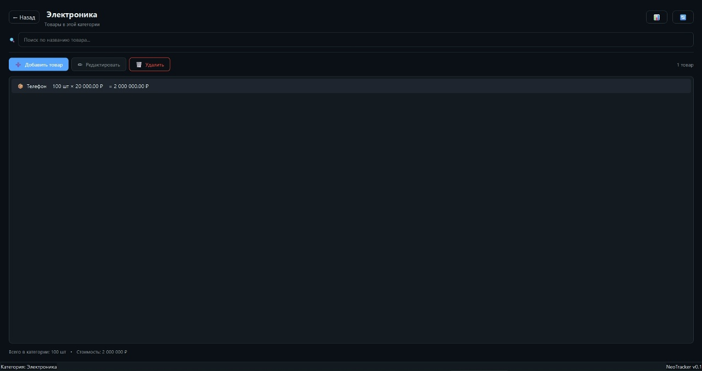
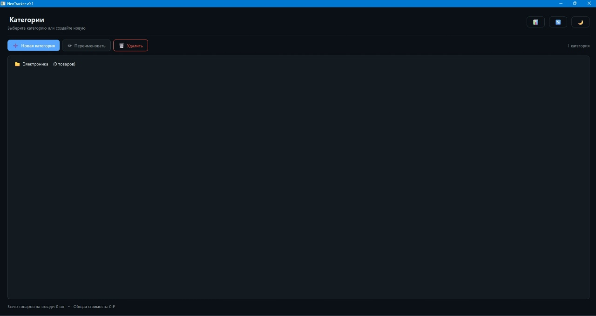

<div align="center">

# 🧠 NeoBrain Launcher


</div>


**NeoBrain Launcher** — центральная панель управления для запуска всех проектов NeoBrain в одном окне.  
Включает **6 проектов**: AI-чат, генератор чеков, виртуальную ОС, учёт товаров и другие утилиты.

---

## 📸 Скриншот

<div align="center">


*6 проектов в одном окне — NeoBrain, Brain Clicker, NeoSpace OS, Why Does This Exist?, NeoReceipt и **NeoTracker***

</div>

---

## 🚀 Проекты

<table>
<tr>
<td width="50%" valign="top">

### 🧠 NeoBrain AI Chat v7.4
Локальный AI-чат с персонажами через **Ollama**.

- 🎭 Персонажи (имя, пол, характер)
- ⚡ Потоковый режим + остановка
- 🌐 Русский / English
- 🎨 10 тем, 5 стилей

</td>
<td width="50%" valign="top">

### 📦 NeoTracker v0.1 ⭐ NEW
Простая программа учёта товаров для малого бизнеса.

- 📁 Категории и товары
- 🔍 Поиск
- 📊 Экспорт в Excel
- 🌙 Тёмная / светлая темы

</td>
</tr>
<tr>
<td width="50%" valign="top">

### 🧾 NeoReceipt 2.0
Генератор чеков с Live Preview.

- 📊 Мульти-товары
- 👁️ Живой предпросмотр
- 💾 Шаблоны
- 🔍 История

</td>
<td width="50%" valign="top">

### 🖥️ NeoSpace OS
Виртуальная среда для экспериментов.

- 🚀 Виртуальные пространства
- 🎨 Кастомизация
- 🧪 Эксперименты

</td>
</tr>
<tr>
<td width="50%" valign="top">

### 🌀 Why Does This Exist?
Интерактивная панель с эффектами.

- 🎨 12 спецрежимов
- 🧘 Антистресс-эффекты
- ⚡ Оптимизация

</td>
<td width="50%" valign="top">

### 🎮 Brain Clicker
Кликер с мозгами.

- 🧠 3 фигуры тени
- 🎁 Уникальные подарки
- 💤 Оффлайн-прогресс

</td>
</tr>
</table>

---

## 📦 NeoTracker — подробнее

<div align="center">





</div>

**Инди-проект.** Лёгкая программа для учёта товаров на складе. Простой интерфейс, локальное хранение, без облаков и подписок.

**Возможности:**
- ✅ Категории и товары
- ✅ Поиск по названию
- ✅ Экспорт в Excel (сводный отчёт + по категориям)
- ✅ Тёмная и светлая темы
- ✅ Локальное хранение (SQLite)
- ✅ Сборка в `.exe`

**Стек:** Python, PySide6, SQLite, openpyxl

---

## 📥 Скачать

**Последняя версия:** [**NeoLauncher v2.2.0**](https://github.com/Sbeuvadyarik67/NeoLauncher-/releases/latest)

1. Скачай `NeoLauncher_v2.2.0.zip`
2. Распакуй в любую папку
3. Запусти `NeoLauncher.exe`

> **Требования:** [Python 3.10+](https://www.python.org/downloads/) и [Ollama](https://ollama.com/) — для NeoBrain AI.

---

## ✨ Особенности

- 🚀 Быстрый запуск проектов одним кликом
- 🎨 **Карусель + сетка** — два режима отображения
- 🖱️ Плавный hover: карточка приподнимается
- ⚡ Скролл колёсиком + стрелками
- 🧠 NeoBrain AI — локальный чат с персонажами
- 📦 **NeoTracker** — учёт товаров для малого бизнеса
- 📄 NeoReceipt — генератор чеков
- 🖥️ NeoSpace OS — виртуальная среда
- 🔄 Exe не надо пересобирать при обновлении `.py`-файлов
- 🎮 Brain Clicker — кликер с мозгами

---

## 🚀 Установка

### Для пользователей

Скачай готовый архив со страницы [**Releases**](https://github.com/Sbeuvadyarik67/NeoLauncher-/releases/latest) — распакуй — запусти `NeoLauncher.exe`.

### Для разработчиков

```bash
git clone https://github.com/Sbeuvadyarik67/NeoLauncher-.git
cd NeoLauncher-
pip install -r requirements.txt
python launcher.py
```

### Сборка .exe

```bash
pip install pyinstaller
pyinstaller NeoLauncher.spec
```

Готовый exe — в папке `dist/`.

---

## 📂 Структура

```
NeoLauncher/
├── launcher.py              # Лаунчер
├── ui_theme.py              # Визуальная тема (Glass Tiles)
├── manifest.json            # Список проектов
├── icon.ico / icon.png      # Иконки
├── requirements.txt         # Зависимости
├── assets/
│   └── screenshots/         # Скриншоты
└── projects/
    ├── neobrain.py          # 🧠 NeoBrain AI Chat
    ├── neoreceipt.py        # 🧾 NeoReceipt
    ├── neospace.py          # 🖥️ NeoSpace OS
    ├── whydoes.py           # 🌀 Why Does This Exist?
    ├── brain-clicker/       # 🎮 Brain Clicker
    │   ├── index.html
    │   ├── style.css
    │   └── script.js
    └── NeoTracker/          # 📦 NeoTracker
        └── NeoTracker.exe
```

---

## 🧠 NeoBrain AI Chat

Локальный AI-чат с персонажами.

- 🎭 Персонажи с именем, полом, характером (учёт рода: он/она)
- ⚡ Потоковый режим (можно отключить)
- ⏹ Кнопка остановки генерации
- 🌐 Русский / English
- 🎨 10 тем: Неон, Тёмная, Ночная, Киберпанк, Фиолетовая, Светлая, Розовая, Морская, Мятная, Кремовая
- 💅 5 стилей: По умолчанию, Neon, Claude, Glass, Terminal
- ✨ Плавная смена темы
- 🔒 Работает локально через Ollama

**Первый запуск:**

```bash
ollama pull llama3.2:3b
```

---

## ❓ FAQ

**Лаунчер пишет «Нет проектов»?**  
Проверь, что папка `projects/` и файл `manifest.json` лежат **рядом** с `NeoLauncher.exe`.

**Нужен ли интернет для NeoBrain?**  
Нет, если модель уже скачана в Ollama. Первый раз: `ollama pull llama3.2:3b`.

**Как обновить проект?**  
Замени `.py`-файл в `projects/`. Exe пересобирать **не нужно**.

**Как запустить Brain Clicker?**  
Через лаунчер: открой `NeoLauncher.exe` → карточка `Brain Clicker` → `▶ ЗАПУСТИТЬ`.  
Игра откроется в браузере (HTML + JS).

**Как запустить NeoTracker?**  
Через лаунчер: `NeoLauncher.exe` → карточка `NeoTracker` → `▶ ЗАПУСТИТЬ`.

---

## 🛠️ Технологии

<p align="center">
  
  
  
  
  
  
  
</p>

---

## ⭐ Поддержать проект

Если проект полезен:

- ⭐ Поставь **звезду** на GitHub — это мотивирует!
- 🐛 Нашёл баг? [Открой Issue](https://github.com/Sbeuvadyarik67/NeoLauncher-/issues/new/choose)
- 💡 Есть идея? [Предложи фичу](https://github.com/Sbeuvadyarik67/NeoLauncher-/issues/new/choose)

---

## 📬 Контакты

- **VK:** [vk.ru/v_rusich007](https://vk.ru/v_rusich007)
- **Telegram:** [t.me/sbeuvadyarik](https://t.me/sbeuvadyarik)
- **Gmail:** vvadya041@gmail.com

---

## 📜 Лицензия

MIT License © 2026 Sbeuvadyarik67

**Сделано с ❤️ и 🧠**
